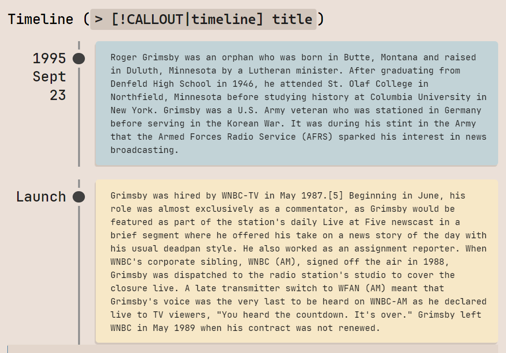

> [!WARNING]
> This theme is in beta stage and isn't well tested. Using it will not do any harm, but you will likely encounter places where theming is broken, especially on mobile and monitors with unusual resolutions. If that happens, please open an issue to let me know. With your help, once those issues are identified and all platforms are tested Kabadoni will come out of beta and will be submitted for inclusion in Obsidian.

Using a light theme doesn't have to mean that your entire computer screen is a shining beacon of white light. For many, dark themes are difficult to use in long working sessions, but light themes tend to make everything white and reduce contrast, making it difficult to navigate in the software and focus on the work at hand. Kabadoni is an Obsidian theme that distinguishes between reading area and user interface, which means choosing a light or dark theme only changes it for reading area, while rest of the UI remains calm, grey colors. This puts greater emphasis on center, where user is working and removes distractions from the sight, allowing for a greater focus sessions.

Kabadoni is mainly developed as a light theme that uses soothing kraft paper colors for background that makes reading black text easier, and doesn't strain the eye. However, a dark variant is also provided, which is a blend between default Obsidian and default VS Code dark themes with more contrasting text colors and benefits from same features as light theme.

# Features:
Kabadoni includes many pure-CSS features for Obsidian.

### 1. Outliner Icons
Markdown files, open & closed folders, canvases, and many other file types have colored icons in the Files view.

### 2. Callout Styles
Using only native capabilities of Markdown and CSS, Kabadoni allows styling callout blocks in different ways by simply providing a tag. There are currently five styles available, a default one, and four alternatives: Timeline, Directory, Icon, and Outline. To change to either of them, a simple tag has to be added to the callout definition, for example `> [!NOTE|timeline]`. Callout types can also be combined, as long as they don't have overlapping features.

### 3. Alternative Checkboxes
As many other themes do, Kabadoni also has alternative icons for checkboxes that use different letters in brackets. However, in Kabadoni checkboxes are strictly meant to be used as that - checkboxes, meaning alternative checkboxes are provided to distinguish between states and importance of tasks, and not to replace them with emojis.

### 4. Tables
Tables in Kabadoni have a very distinctive look that stands out from the rest of the background. First row of the table, heading, is also themed to look different from the rest of the table - it has differently colored background, separating line, and is always bold.

---

# How to Install:

- Download latest package.
- Copy "Kabadoni" folder inside `...YourVault/.obsidian/themes`.
- Inside Obsidian open preferences -> Appearance and choose "Kabadoni" from Theme dropdown list.

---

# Known Issues & Limitations:
- Obsidian has poor handling of pop-up windows and doesn't always allow individual theme overrides. In some of the pop-ups it's possible that text or background might have wrong theme colors, or text might be rendered with accent color.
- Plugins tend to incorrectly use Obsidian's theme properties or implement their own. If colors in plugins are incorrect file a bug report, since in that case it might need special handling, but it will not always be possible.
- File & folder icons do not appear in bookmarks, and are shown as unknown in Recent Files tab.
- Large icon in callouts might be missing when combined with Timeline styling.

---

# Acknowledgements:
- When learning about Obsidian theming I used the code of many themes for inspiration and guidance, most notably [Primary](https://github.com/primary-theme/obsidian), [Obsidian Nord](https://github.com/insanum/obsidian_nord), [Sanctum](https://github.com/jdanielmourao/obsidian-sanctum), [Things](https://github.com/colineckert/obsidian-things), and [Github Theme](https://github.com/krios2146/obsidian-theme-github)
- All icons are taken from [SVGrepo.com](https://www.svgrepo.com/)
- Callout styles are adapted from examples found in [Obsidian-CSS-Snippets](https://github.com/r-u-s-h-i-k-e-s-h/Obsidian-CSS-Snippets) repository: Timeline by FireIsGood, Folder Structure by BunkerD, Icons by efemkay.

> [!NOTE]
> Font seen in screenshots is [JetBrains Mono](https://www.jetbrains.com/lp/mono/)

---

# Color Palette

